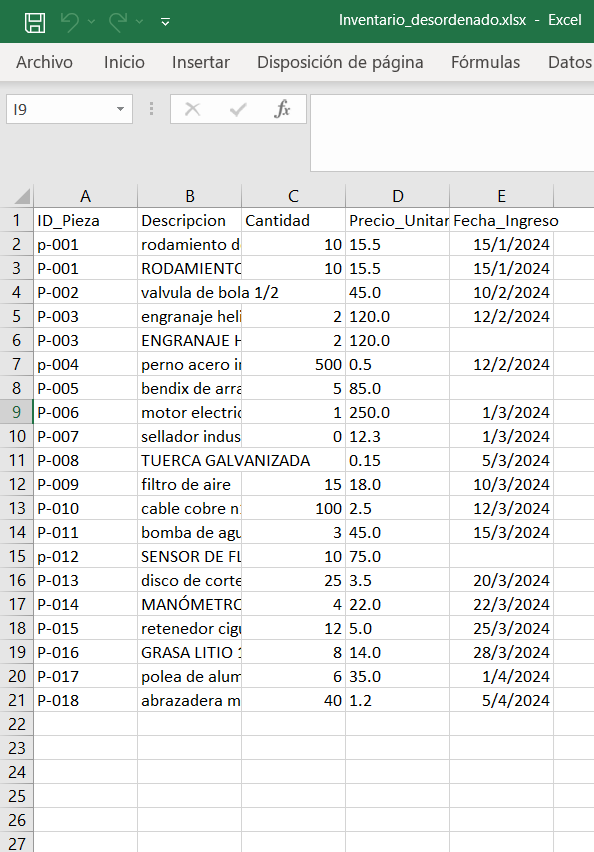
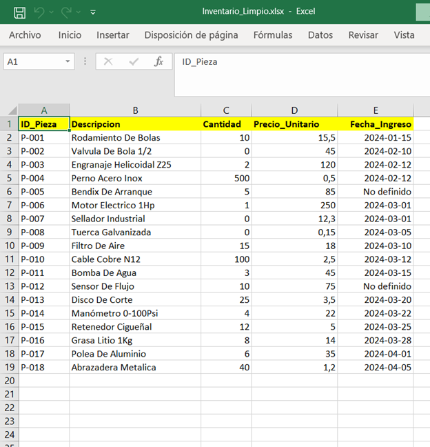

# Automatización de Limpieza de Inventarios (Python)

Este proyecto nace de la necesidad de optimizar la gestión de datos en la ingeniería. Transforma archivos Excel desordenados recursivamente en reportes ejecutivos listos para la toma de decisiones.

## Funcionalidades
- **Normalización de IDs:** Elimina espacios y estandariza a mayúsculas.
- **Limpieza de Texto:** Convierte descripciones desorganizadas a formato 'Título'.
- **Integridad de Datos:** Maneja valores nulos en cantidades y precios (NaN -> 0).
- **Tratamiento de Fechas:** Elimina estampas de tiempo y etiqueta datos faltantes.
- **Diseño Ejecutivo:** Auto-ajuste de columnas, encabezados destacados y alineación técnica.

## Tecnologías
- **Python 3.x**
- **Pandas:** Procesamiento y limpieza de datos.
- **OpenPyXL:** Diseño y estilizado de hojas de cálculo.

## 📈 Antes y Después
| ANTES (Datos Sucios) | DESPUÉS (Reporte Automatizado) |
| :---: | :---: |
|  | 
